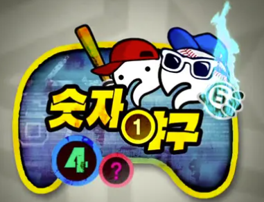
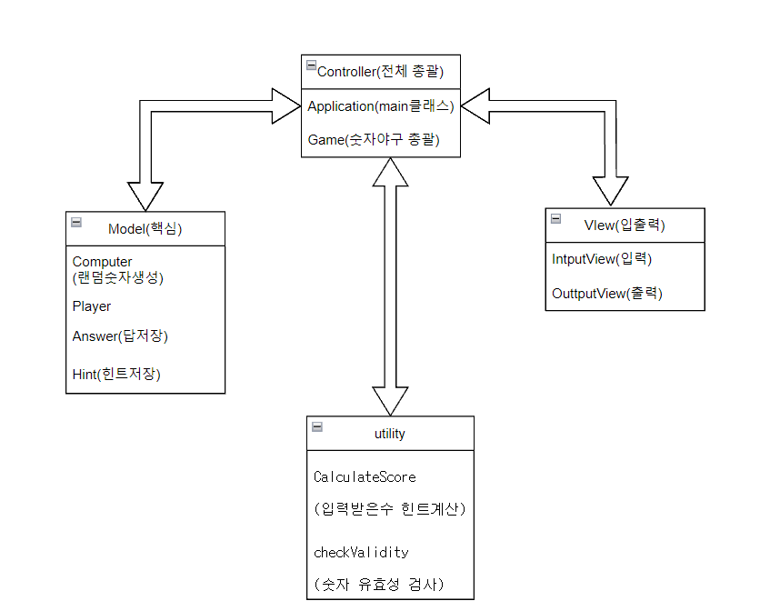

#미니과제 JAVA-baseball
---

# 숫자야구 소개

1~9사이의 서로 다른 수로 이루어진 3자리의 수를 사용자가 맞추는 게임

- 같은 수 같은자리 => 스트라이크

- 같은 수 다른자리 => 볼

- 같은 수가 없다면 => 낫싱

위의 힌트를 이용해 똑같은 수를 찾으면 승리한다.

---
# 전체적 흐름

   
    게임시작
    
    랜덤한 3자리수 생성하기 
    
    사용자로 부터 3자리수 값 입력받기
    
    정답과 입력한 수 비교해서 힌트 출력
    
    3개의 숫자를 모두 맞출 때 까지 반복
    
    맞추면 게임은 종료 
    
    다시 게임을 시작 or 게임 종료

---
#구현 기능 목록

- 컴퓨터의 랜덤한 숫자 생성
    - 자바의 Math.random()을 이용해서 1~9 무작위 수 생성
    - boolean[] 으로 중복되는지 검사
    - 3자리의 수가 되면 종료 
    
- 유저로 부터 숫자 입력 받기
    - 숫자를 입력 받음
    - 유요한 입력이 아니면 IllegalArgumentException 발생 후 종료
    
- 입력받은 숫자와 정답 비교하기
    - 생성된 정답과 입력 받은 수 비교
    - 생성된 힌트들을 출력
    
- 게임 진행
    1. 숫자 생성
    2. 숫자 입력 받음
    3. 정답과 숫자 비교
    4. 힌트 출력
    5. 정답일 때까지 2-4 과정 반복 
    
- 게임 반복
    - 게임 종료후 재시작 할지 종료할지 입력
    - 재시작이면 게임 진행
    - 종료면 프로그램 종료 
    
 ---
 
#MVC모델

- Model
    - Computer: 랜덤 숫자 생성
    - Player  : 3자리수 입력
    - Answer  : 컴퓨터가 생성한 정답 저장
    - Hint    : 플레이어가 입력한 수의 힌트 저장
- Controller
    - Application : 메인 클래스
    - Game        : 숫자야구 총괄
- View
    - InputView   : 입력
    - OutputView  : 출력
- utility
    - calculateScore : 힌트 계산 
    - checkValidity  : 입력한 숫자 유효성 검사

